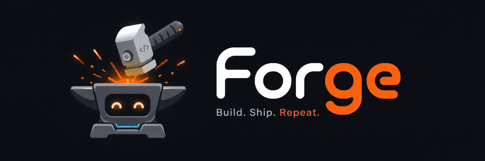
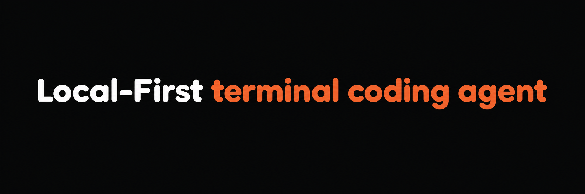

<p align="center">
  
</p>

<p align="center">
  Fast Go TUI · Global Hub · Persistent Claw companion.
</p>

---

Forge runs against LM Studio, OpenAI-compatible APIs, and the OpenAI API. It supports Claude-style plugins, [skills.sh](https://skills.sh), MCP, LAN remote control, pluggable web search, and a resident companion that can pair with WhatsApp.

<p align="center">
  
</p>

## Install

One command, any platform:

```bash
git clone https://github.com/defexnicolas/forge.git
cd forge
bash forgetui.sh
```

`forgetui.sh` provisions a private Go toolchain under `~/.forgetui/`, best-effort installs Python and Node.js, builds Forge, copies the binary to `~/bin` (Windows) or `~/.local/bin` (macOS/Linux), and prints the exact PATH command for your shell.

Useful env vars: `INSTALL_OPTIONAL_RUNTIMES=0` to skip Python/Node, `INSTALL_TO_USER_BIN=0` to skip global install, `INSTALL_BIN_DIR=...` to override the target.

<details>
<summary>Manual build</summary>

Requires Go 1.25+.

```bash
go build -o forge.exe ./cmd/forge   # Windows
go build -o forge     ./cmd/forge   # macOS / Linux
```
</details>

Verify:

```bash
forge --help
```

## First Run

```bash
forge                          # opens the Hub
forge --cwd /path/to/project   # jumps straight to a workspace
```

State layout:

- `~/.forge/global.toml` — Hub-level defaults shared across workspaces
- `~/.forge/hub_state.json` — recent/pinned workspaces, migration flags
- `~/.forge/claw/` — Claw memory, channels, sessions
- `~/.forge/cache/` — skills, QR assets, shared caches
- `<repo>/.forge/config.toml` — workspace overrides

Legacy state under `~/.codex` is migrated automatically on startup.

## Quick Start

**LM Studio.** Load a model, start the server on `http://localhost:1234/v1`, run `forge`.

**OpenAI-compatible.** In `<repo>/.forge/config.toml`:

```toml
[providers.default]
name = "openai_compatible"

[providers.openai_compatible]
base_url = "https://api.openai.com/v1"
api_key_env = "OPENAI_API_KEY"
default_model = "gpt-5.4-mini"
supports_tools = true
```

Then `export OPENAI_API_KEY=sk-...` and `forge --cwd /your/project`.

> **Dev recommendation — always use `/model-multi`.**
> Even when you want a single model for every mode, configure it through `/model-multi` instead of `/model`. Forge handles parallelism better when models are declared per-mode, and the same UI lets you assign different models to `chat`, `explore`, `plan`, and `build` whenever you need to.

## Concepts

**Hub.** Global control plane: workspace explorer, recent/pinned, global chat, skills browser, plugin/MCP inspection, Claw management. Writes shared defaults to `~/.forge/global.toml`.

**Modes.** Workspaces switch between four modes via `/mode`:

| Mode | Purpose |
|---|---|
| `chat` | Conversation with read-only tools when useful. |
| `explore` | Read-only codebase understanding. |
| `plan` | Writes the plan and checklist. Does not edit files. |
| `build` | Executes the checklist with editor tools under approval. Default mode. |

**Claw.** Persistent companion under `~/.forge/claw/`: onboarding interview, memory summaries, heartbeat/dream loops, contacts, facts, reminders, workspace notes, and tool-aware chat. Commands: `/claw status | interview | start | stop | dream | memory | soul | reset | cron add <name> <duration> <prompt>`.

**WhatsApp.** Pair from Hub → Claw → Channels (QR flow). Outbound via `whatsapp_send`; inbound DMs can be auto-replied. Guardrails always on: typing simulation, rate limiting, first-contact link guard, allowlists, explicit approval unless an auto-approval profile is selected.

**Web search.** Pluggable backend, same config for main agent and Claw:

```toml
[web_search]
provider = "duckduckgo"   # default, no key
# provider = "ollama"
# api_key_env = "OLLAMA_API_KEY"
# base_url = "https://ollama.com"
```

**Plugins.** Discovered from `.forge/plugins/` and `.claude/plugins/`. Supports `commands/`, `agents/`, `hooks/`, `.mcp.json`, `skills/`, `.lsp.json`, `settings.json` (safe subset), and `output-styles/`. `bin/` is recognized but never auto-executed.

**Skills.** Native [skills.sh](https://skills.sh) and plugin-shipped support: `/skills`, `/skills refresh`, `/skills <repo>`, `/skills cache`. Workspace installs go to `.forge/skills/`; global to `~/.forge/skills/`.

**MCP.** Drop `.mcp.json` in the project or ship from a plugin. Inspect with `/mcp`, `/mcp resources`, `/mcp prompts`.

## Built-in Tools

| Category | Tools |
|---|---|
| Filesystem | `read_file`, `list_files`, `write_file`, `edit_file`, `apply_patch` |
| Search | `search_text`, `search_files` |
| Git | `git_status`, `git_diff` |
| Shell | `run_command`, `powershell_command`, `python_setup`, `python_run` |
| Web | `web_fetch`, `web_search` |
| Planning | `plan_write`, `plan_get`, `todo_write`, `task_create`, `task_list`, `task_get`, `task_update`, `execute_task` |
| Subagents | `spawn_subagent`, `spawn_subagents` |
| Interactive | `ask_user` |
| Skills | `skill` |
| Claw | `whatsapp_send`, `claw_save_contact`, `claw_lookup_contact`, `claw_remember`, `claw_recall`, `claw_schedule_reminder`, `claw_list_reminders`, `claw_cancel_reminder`, `claw_workspace_note` |

## Slash Commands

| Command | Purpose |
|---|---|
| `/mode [name]` | switch between `chat`, `explore`, `plan`, `build` |
| `/plan [panel\|full\|todos\|new\|refine]` | inspect or refresh the plan/checklist |
| `/model`, `/model-multi`, `/provider` | manage models (single or per-mode) and provider config |
| `/skills`, `/plugins`, `/mcp` | browse skills, plugins, MCP |
| `/claw ...` | manage the resident Claw service |
| `/review` | switch to review/diff workflow |
| `/remote-control [start\|stop\|status] [port]` | expose the session over LAN |
| `/status`, `/config` | runtime status and effective config |

## Configuration

Two layers: global (`~/.forge/global.toml`) overridden per-workspace (`<repo>/.forge/config.toml`).

```toml
default_agent = "build"
approval_profile = "normal"

[providers.default]
name = "lmstudio"

[model_loading]
enabled = false
strategy = "single"
parallel_slots = 2

[context.yarn]
profile = "9B"
render_mode = "head"

[web_search]
provider = "duckduckgo"

[claw]
enabled = true
autostart = false
tools_enabled = true
default_channel = "mock"
persona_name = "Claw"
persona_tone = "warm"

[build.subagents]
enabled = true
concurrency = 3
```

Defaults: Claw tools on once Claw is enabled, plugin loading on, model loading uses `parallel_slots = 2`, Hub persists shared settings globally instead of stamping every workspace.

## Build, Test, Format

```bash
go build ./...
go test ./...
gofmt -w ./cmd ./internal
```

## More

- Architecture deep-dive: [`docs/ARCHITECTURE.md`](docs/ARCHITECTURE.md)
- Agent guidelines: [`AGENTS.md`](AGENTS.md)

## License

Licensed under Apache 2.0. See [`LICENSE`](LICENSE).
